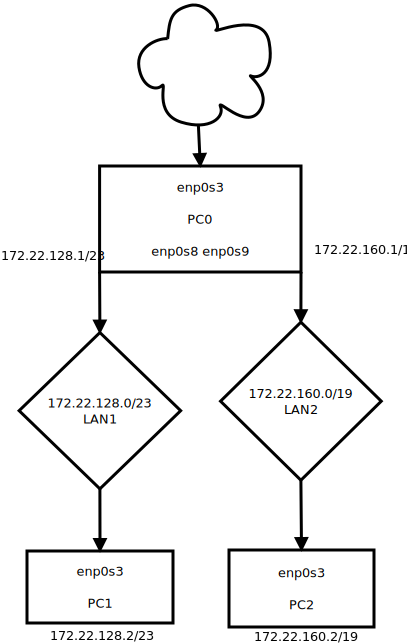

### Maski podsieci i adresy

- LAN1 255.255.254.0 | 172.22.128.0/23
- LAN2 255.255.224.0 | 172.22.160.0/19

### PC0
- enp0s3 - internet
- enp0s8 - LAN1
- enp0s9 - LAN2

- ip addr add 172.22.128.1/23 dev enp0s8
- ip addr add 172.22.160.1/19 dev enp0s9
- echo 1 > /proc/sys/net/ipv4/ip_forward
- iptables -t nat -A POSTROUTING -s 172.22.128.0/23 -o enp0s3 -j MASQUERADE
- iptables -t nat -A POSTROUTING -s 172.22.160.0/19 -o enp0s3 -j MASQUERADE
- ip link set enp0s3 up
- ip link set enp0s8 up
- ip link set enp0s9 up

### PC1
- enp0s3 - LAN1

- ip addr add 172.22.128.2/23 dev enp0s3
- ip route delete default
- ip route add default via 172.22.128.1 dev enp0s3

### PC2
- enp0s3 - LAN2

- ip addr add 172.160.2/19 dev enp0s3
- ip route delete default
- ip route add default via 172.22.160.1 dev enp0s3

 ### Schemat

