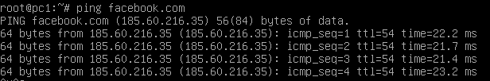
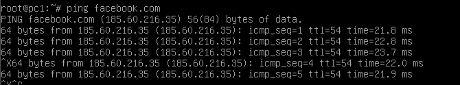

Zadanie 1
---------

1. Zaprojektuj oraz przygotuj prototyp rozwiązania z wykorzystaniem oprogramowania ``VirtualBox`` lub podobnego. 
Zaproponuj rozwiązanie spełniające poniższe wymagania:
   * Usługodawca zapewnia domunikację z siecią internet poprzez interfejs ``eth0`` ``PC0``
   * Zapewnij komunikację z siecią internet na poziomie ``LAN1`` oraz ``LAN2``
   * Dokonaj takiego podziału sieci o adresie ``172.22.128.0/17`` aby w ``LAN1`` można było zaadresować ``500`` adresów natomiast w LAN2 ``5000`` adresów    
   * Przygotuj dokumentację powyższej architektury w formie graficznej w programie ``DIA``
 
 
 ## LAN1:
 
 Maska: 255.255.254.0 /23  
 Adres podsieci: 172.22.160.0
 
 ## LAN2:

 Maska: 255.255.224.0 /19 
 Adres podsieci: 172.22.128.0
 
## PC0:
 
 eth0s3: Połączenie z internetem 
 eth0s8: 172.22.128.1/19 
 eth0s9: 172.22.160.1/23 
 
 ## PC1:

 eth0s3: 172.22.160.2/23 
 
## PC2:
 
 eth0s3: 172.22.128.3/19 
 
 # Sposób działania:
 
 ## 1. ip addr add xxx.xxx.xxx.xxx/xx dev xxxxxx - ustawiamy adresy   
 ###### PC0 - 172.22.160.1/23 i 172.22.128.1/19   
 ###### PC1 - 172.22.160.2/23  
 ###### PC2 - 172.22.128.2/19 
 
 ## 2. echo 1 > /proc/sys/net/ipv4/ip_forward - ustawiamy przekazywanie adresów ( ip forwarding )
 
 ## 3. pico /etc/resolv.conf - ustawienie domyślnego DNS'a ( 8.8.8.8 )
 
 ## 4. ip route add default via adres_interfejsu - ustawiamy domyślną bramę dla hostów
 ###### PC1 - 172.22.160.1/23
 ###### PC2 - 172.22.128.1/19
 
 ## 5. iptables -t nat -A POSTROUTING -o nazwa_interfejsu -j MASQUERADE - pozwoli na udostępnienie internetu PC1 i PC2
 
 ## Dostęp do internetu z PC1:
  
 
  ## Dostęp do internetu z PC2:
 
 
